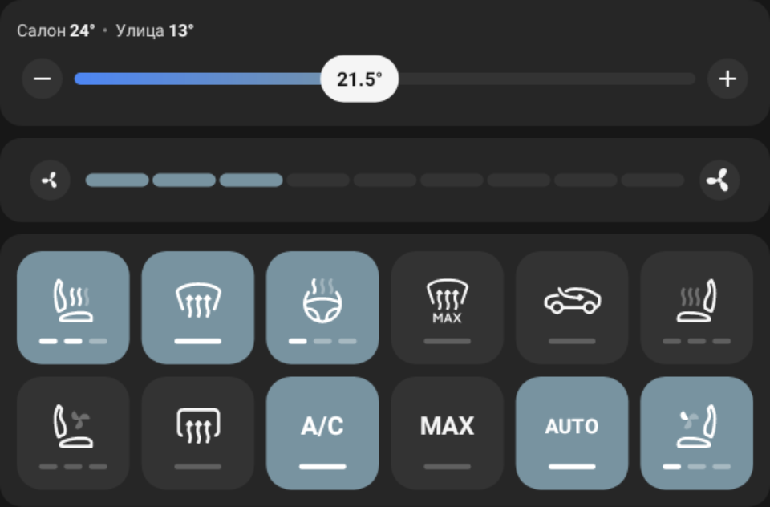
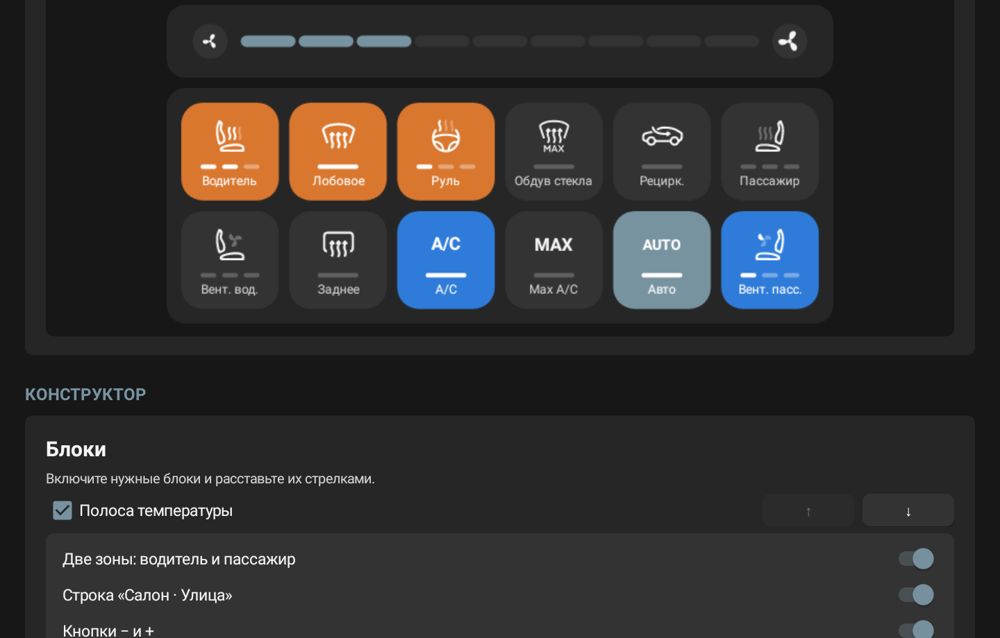

# Atlas Climate Widget

Конструктор климатического виджета для главного экрана портретных ГУ Geely OneOS на Android 11.
Все данные и команды автомобиля проходят через [GInputBridge](../GInputBridge)
(`com.salat.gbinder`).

В отличие от Atlas App Widget и Atlas Media Widget, это **настоящий Android** `AppWidget`:  
его размещает любой лаунчер с поддержкой виджетов, например AtlasLauncher.

<p align="center">
  
</p>

<sub>На изображении демо-данные предпросмотра.</sub>

## Возможности

- полоса температуры в стиле FX11: нажатие на полосу задаёт температуру с шагом 0,5 °C
  и открывает поверх неё слайдер, который можно тянуть пальцем; кнопки − и + меняют
  температуру на 0,5 или 1 °C, у краёв диапазона показываются LO/HI;
- одна или две зоны (водитель и пассажир), строка «Салон · Улица» с датчиков температуры;
- скорость обдува на выбор: уровни 1–9 (нажатие и протяжка, в режиме AUTO кнопки − и +
  переключают профиль авто-обдува) или пресеты «Мягко · Комфорт · Сильно»;
- плитки функций в стиле лаунчера GInputBridge: иконка, индикатор уровня или состояния,
  подпись по желанию;
- функции: климат вкл/выкл, AUTO, A/C, MAX A/C, рециркуляция, обогрев лобового и заднего
  стекла, максимальный обдув стекла, подогрев руля, подогрев и вентиляция сидений (включая
  задний ряд), направления обдува (лицо, ноги, стекло с комбинациями), профили авто-обдува,
  синхронизация температуры, ECO, ионизатор, а также «Мне жарко», «Я замёрз» и штатное меню
  климата из GInputBridge;
- конструктор: включение и порядок блоков, выбор и порядок функций, число столбцов, вид плиток
  («Плитка», «Плитка с подписью», «Только иконка»);
- оформление в графитовой палитре Atlas: палитра активных плиток (Atlas, синий, бирюзовый,
  изумрудный, фиолетовый или «по смыслу» — обогрев тёплый, охлаждение синее), заливка,
  непрозрачность и радиус карточек, отступы, скругление плиток;
- своя раскладка у каждого виджета на экране и шаблон для новых виджетов;
- живой предпросмотр — тот же `RemoteViews`, что и на главном экране;
- явное состояние «нет связи с GInputBridge» вместо устаревших значений.

<p align="center">
  
</p>

## Требования

- Android 11 или новее (`minSdk 30`), портретная ГУ, целевая конфигурация 1440×1920;
- установленный GInputBridge;
- лаунчер, который умеет размещать системные виджеты.

## Установка и запуск

1. Установите APK и откройте **Atlas Climate Widget**.
2. Добавьте виджет «Atlas Climate» через меню виджетов лаунчера.
3. В приложении выберите виджет, соберите нужные блоки и функции и настройте оформление.
4. В разделе «Поведение» укажите автомобиль (влияет на обогрев лобового стекла и кнопки
   обдува), шаг температуры и порядок уровней подогрева.

Пока на экране есть виджет, работает служба синхронизации с уведомлением: GInputBridge отвечает
неявными broadcast'ами, получить их может только запущенный процесс.

## Ограничения виджета

- `RemoteViews` сообщает только о завершённом нажатии, поэтому провести пальцем прямо по
  виджету нельзя: сначала нажатие, затем поверх полосы появляется слайдер для протяжки
  (так же устроена перемотка в Atlas Media Widget). Команда уходит при отпускании пальца;
- долгое нажатие на плитку недоступно; повторное нажатие переключает уровни по кругу;
- состояние «Мне жарко» и «Я замёрз» хранится внутри GInputBridge, поэтому эти плитки не
  показывают индикатор.

## Сборка

Требуются JDK 17 и Android SDK 36.

```sh
sh gradlew --offline clean check assembleRelease
```

APK появляется в `app/build/outputs/apk/release/` с именем
`<versionName>[<versionCode>]AtlasClimateWidget-release.apk`. Подпись подключается локальным
игнорируемым `secure.signing.gradle` по образцу
[`app/secure.signing.gradle.example`](app/secure.signing.gradle.example); без него APK не подписан.

## Совместимость

Идентификаторы свойств, зоны и значения взяты из GInputBridge (`CarPropertyKey`,
`CarFunctionIds`, плитки лаунчера) и сверены с конфигурацией FX11 Widget. Это прошивочные данные,
а не публичный API: сборка и модульные тесты не подтверждают поведение на реальной ГУ.
Подробнее — в [docs/ginputbridge-contract.md](docs/ginputbridge-contract.md).
